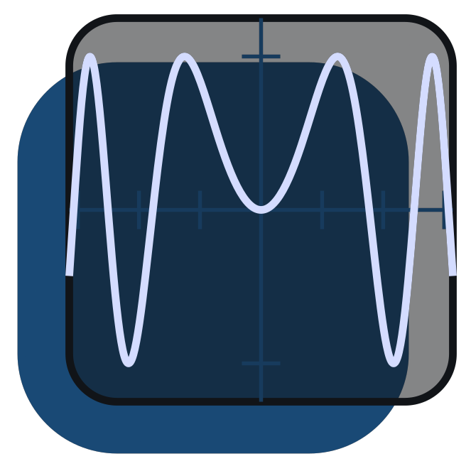
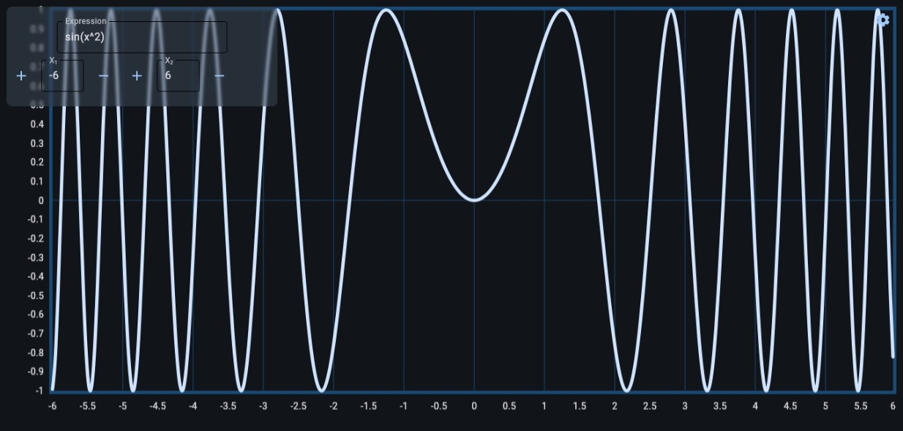

<div align="center">
  <a href="https://github.com/anDev0506/quantum_graphcalc">
    
  </a>
  <h1>Quantum Graphcalc</h1>
  <p>Una aplicación de escritorio y web para graficar funciones matemáticas de una variable, construida con Python, Flet y NumPy.</p>

  
  <p>
    <a href="LICENSE">
      
    </a>
    
    
    
  </p>
</div>

---

## 📜 Tabla de Contenidos
- [📜 Tabla de Contenidos](#-tabla-de-contenidos)
- [🚀 Descripción](#-descripción)
- [✨ Características](#-características)
- [🛠️ Stack Tecnológico](https://github.com/anDev0506/quantum_graphcalc/tree/main?tab=readme-ov-file#%EF%B8%8F-stack-tecnol%C3%B3gico)
- [⚙️ Instalación](https://github.com/anDev0506/quantum_graphcalc/tree/main#%EF%B8%8F-instalaci%C3%B3n)
  - [Prerrequisitos](#prerrequisitos)
  - [Pasos](#pasos)
- [▶️ Ejecución](https://github.com/anDev0506/quantum_graphcalc/tree/main#%EF%B8%8F-ejecuci%C3%B3n)
- [📂 Estructura del Proyecto](#-estructura-del-proyecto)
- [📜 Licencia](#-licencia)

---

## 🚀 Descripción
**Calculadora Gráfica** es una aplicación que permite visualizar funciones matemáticas de una variable. Está diseñada para ser intuitiva y fácil de usar, con soporte para expresiones matemáticas complejas. La aplicación puede ejecutarse tanto en escritorio como en la web, gracias a Flet.

---

## ✨ Características
- ✅ **Graficación de funciones**: Representa funciones matemáticas de una variable en tiempo real.
- ✅ **Interfaz intuitiva**: Diseño limpio y responsivo con Flet.
- ✅ **Parser de expresiones**: Evaluación precisa de expresiones matemáticas usando un parser personalizado.
- ✅ **Soporte multiplataforma**: Ejecución en escritorio y web.
- ✅ **Cálculos con NumPy**: Precisión y rendimiento en operaciones matemáticas.

---

## 🛠️ Stack Tecnológico
- **Lenguaje**: Python 3.x
- **Framework de UI**: [Flet 0.28.2](https://flet.dev/)
- **Librería matemática**: [NumPy 2.3.2](https://numpy.org/)
- **Parser de expresiones**: Implementación personalizada en `newinputfunc.py`

---

## ⚙️ Instalación
Sigue estos pasos para configurar el entorno de desarrollo local.

### Prerrequisitos
- Python 3.x instalado.
- pip (gestor de paquetes de Python).

### Pasos
1. **Clona el repositorio**:
   ```sh
   git clone https://github.com/anDev0506/quantum_graphcalc.git
   ```

2. **Navega al directorio del proyecto**:
   ```sh
   cd quantum_graphcalc
   ```

3. **Instala las dependencias**:
   ```sh
   pip install -r requirements.txt
   ```

---

## ▶️ Ejecución
Una vez instalado, puedes ejecutar la aplicación en diferentes modos:

- **Modo escritorio**:
  ```sh
  flet run
  ```

- **Modo Web**:
  ```sh
  flet run --web
  ```

- **Compilar para Web**:
  ```sh
  flet build web
  ```
  El proyecto compilado se generará en la carpeta `build/web`.

---

## 📂 Estructura del Proyecto
```
├── src/
│   ├── main.py                # Archivo principal (frontend con Flet)
│   └── utils.py               # Clases y funciones de soporte
|   |── assets/
│       ├── captura.jpeg           # Captura del programa en funcionamiento
│       └── icon.png               # Icono del proyecto
|   |── scripts/
│       └── newinputfunc.py        # Parser para expresiones matemáticas
├── build/
│   └── web/                   # Versión compilada para web
├── LICENSE                    # Licencia MIT
├── README.md                  # Este archivo
└── pyproject.toml             # Archivo de configuración del proyecto
```

---

## 📜 Licencia
Este proyecto está licenciado bajo la **MIT License**. Consulta el archivo [LICENSE](LICENSE) para más detalles.
